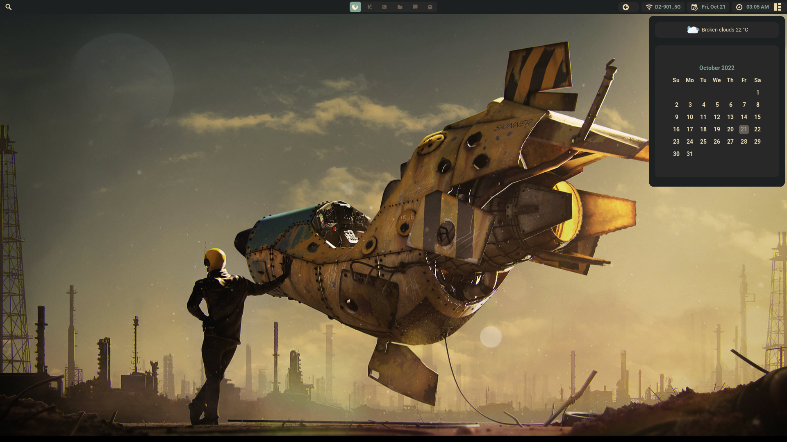
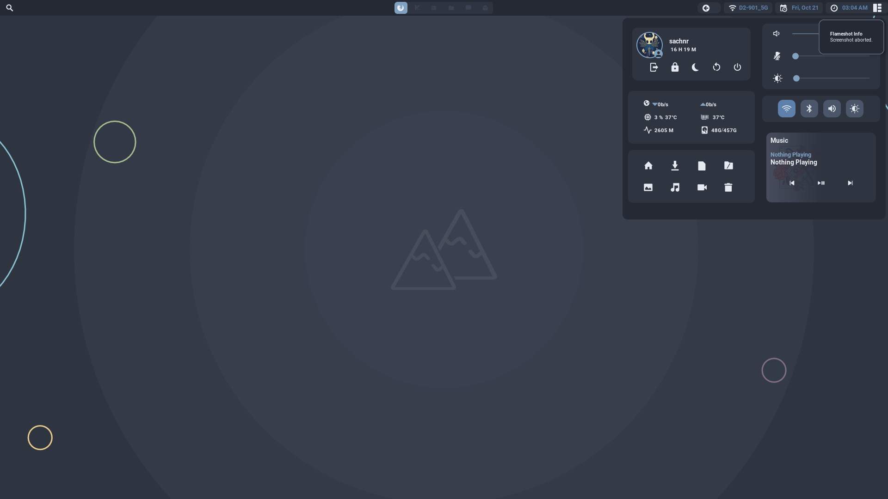
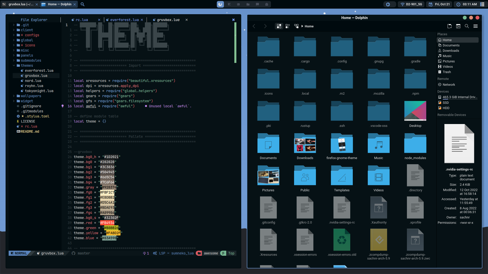
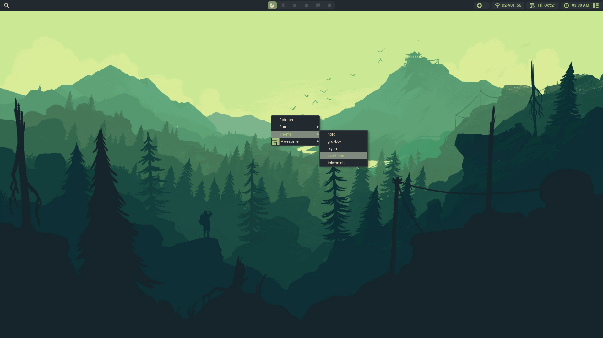
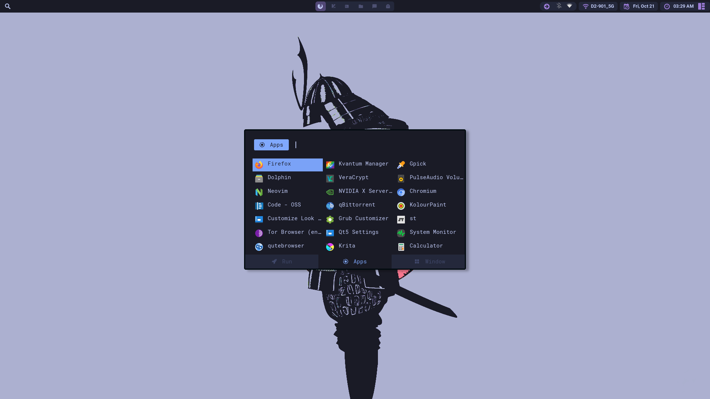

# Dotfiles
Awesome wm dotfiles

|Gruvbox|
|------|
||

|Nord|Rxyhn|
|------|------|
|||

|Everforest|Tokyonight|
|------|------|
|||

### **Window Manager**
```bash
$ sudo dnf in flameshot papirus-icon-theme rofi jq redshift qt5ct kvantum gnome-system-monitor
polkit-gnome gnome-keyring mpd mpc ncmpcpp playerctl mpdris2 -y
```
#### ***awesome、picom、i2lock-color 和 xidlehook 需要自行编译***
1. awesome
2. picom
3. i3lock-color
4. xidlehook

### **Installation**
```bash
$ mkdir -p ~/.config/rofi ~/.local/share
$ cp -r ~/.config/awesome/misc/alacritty/ ~/.config/
$ cp -r ~/.config/awesome/misc/fonts/ ~/.local/share/
$ cp -r ~/.config/awesome/misc/rofi/ ~/.local/share/
$ fc-cache -rv
```
install any [nerdfonts](https://www.nerdfonts.com/) for some icons to appear
### **THEMES**
|Theme|Gtk|Kvantum|
|------|------|------|
|**Nord:**|[link](https://www.gnome-look.org/p/1267246)|[link](https://www.gnome-look.org/p/1326272)|
|**Gruvbox:**|[link](https://www.gnome-look.org/p/1681313/)|[link](https://github.com/sachnr/Gruvbox-Kvantum)|


